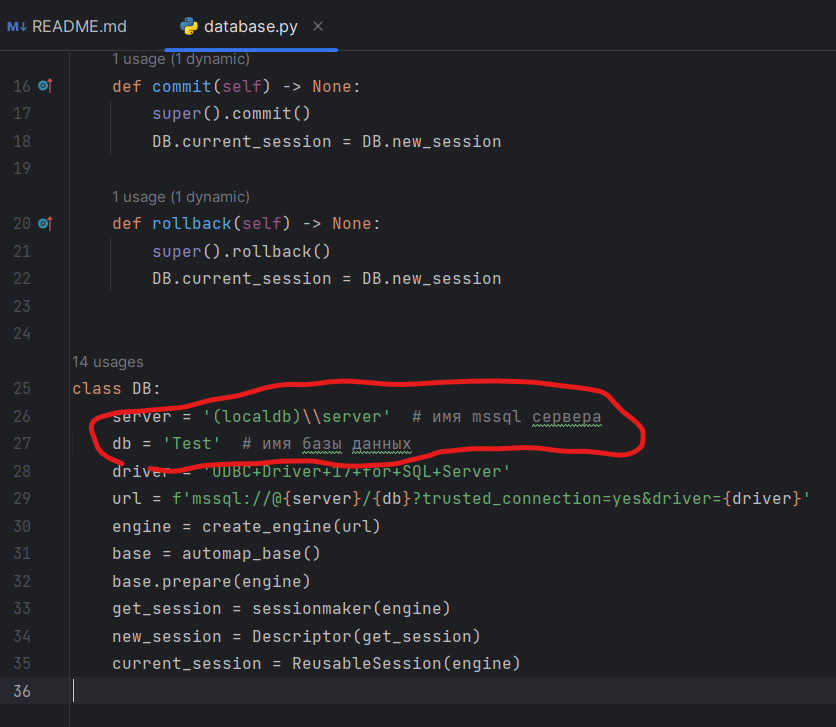

1. Установить библиотеки из requirements.txt
2. Подключить файлы БД из директории data/db
3. Изменить данные для подключения к БД в database.py:

2. Запустить main.py с помощью интерпретатора python